# Presentation

- The editable presentation, covering the project through the Week 7 prototype, is [`DeadlineDesk_Week7_Presentation.pptx`](DeadlineDesk_Week7_Presentation.pptx).
- For a browser-friendly version, open the [Week 7 PDF preview](DeadlineDesk_Week7_Presentation.pdf). GitHub can display the PDF in the browser; the slide gallery below is visible directly on this page.
- The original [`DeadlineDesk_Week4_Presentation.pptx`](DeadlineDesk_Week4_Presentation.pptx) is retained as the earlier milestone source.
- The [Week 4 presentation PDF](https://github.com/aryanorastar/ucs503p-202627-deadlinedesk/blob/master/w4/presentation.pdf) is the earlier milestone, retained for historical context.

The Week 7 deck keeps the Week 4 visual baseline and adds the project schedule, actual Django architecture, placement and academic activity diagrams, the implemented entity model, Week 5–7 progress, and verification evidence. Speaker notes include viva talking points. Week 4 slides are retained as historical context, not as duplicate submission copies.

## Slide preview

These are preview images exported from the editable Week 7 PowerPoint. Open the PDF above for a paginated browser view.

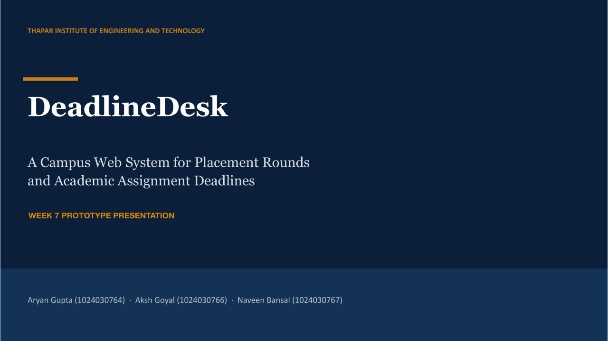

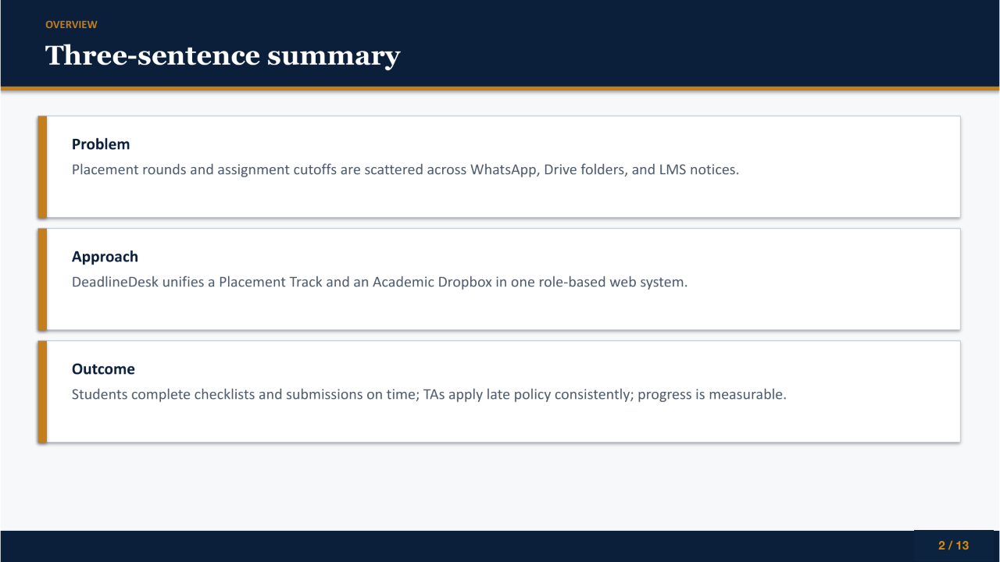

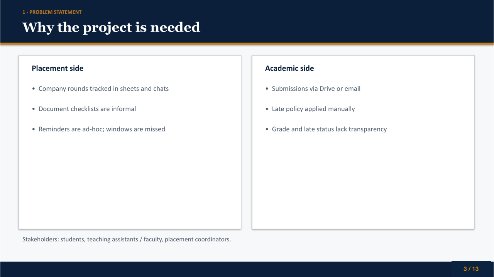

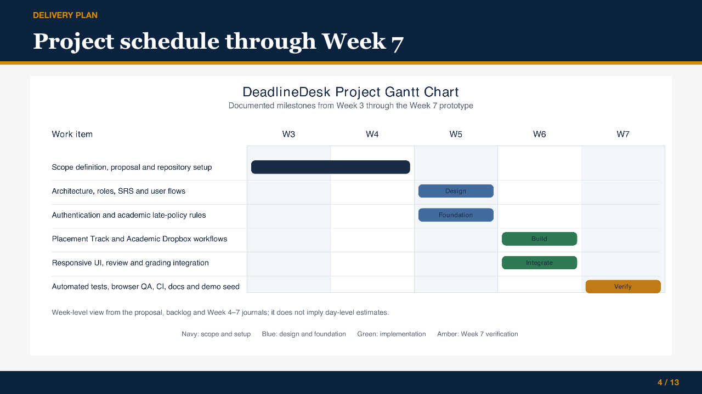

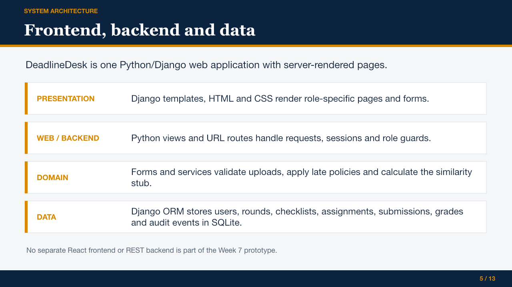

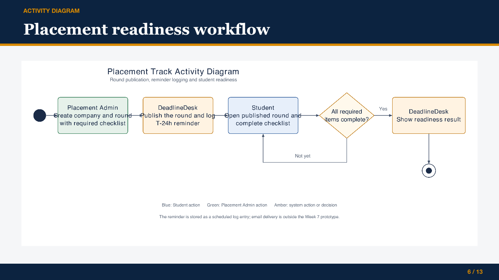

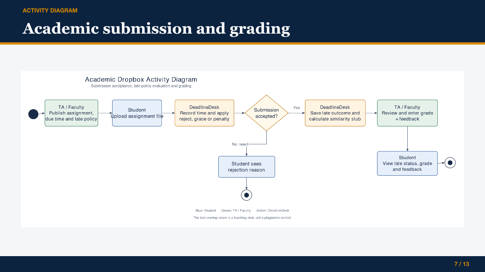

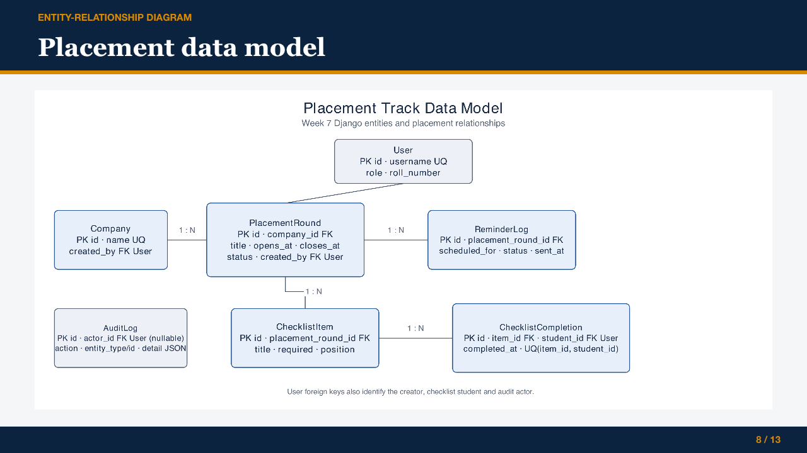

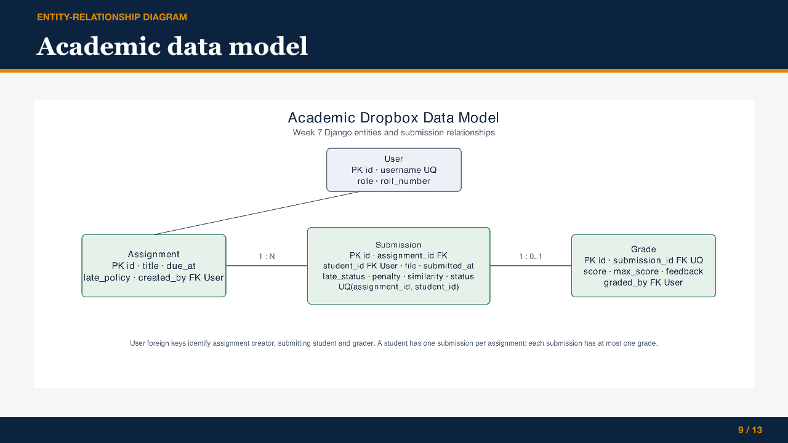

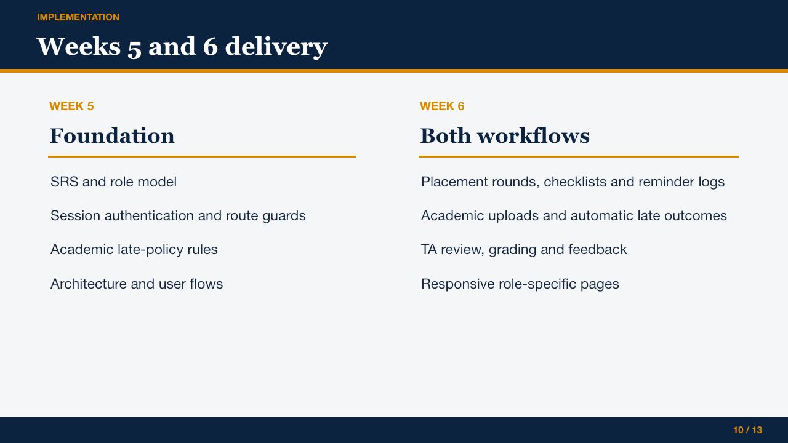

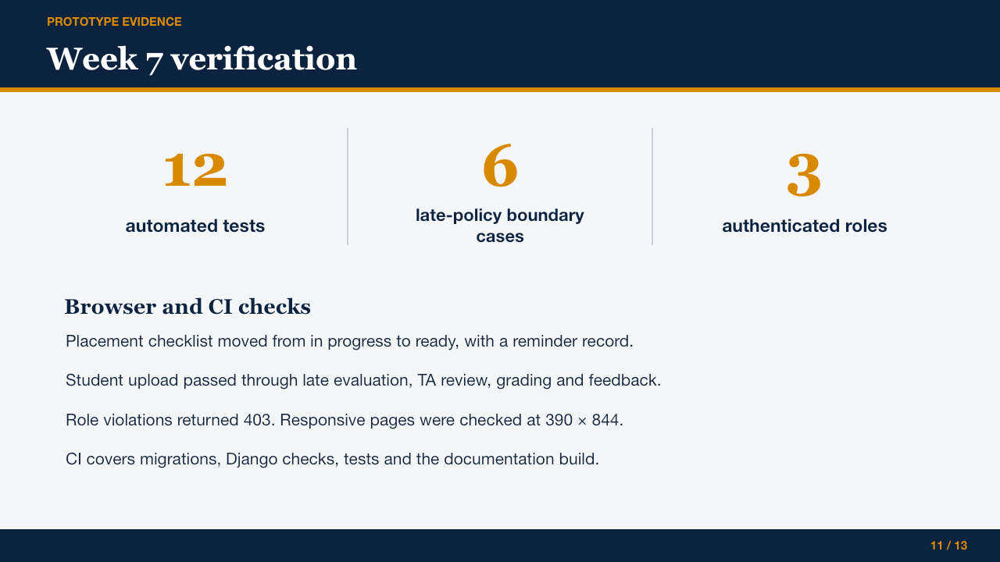

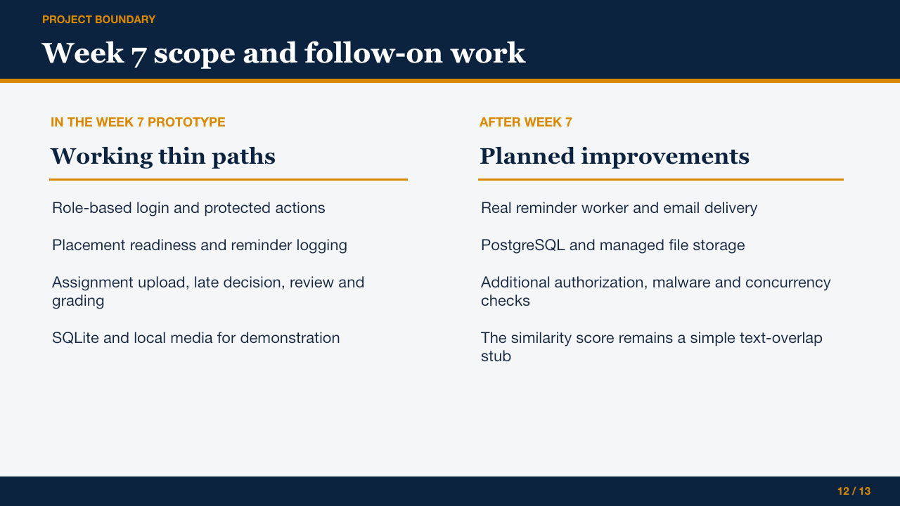

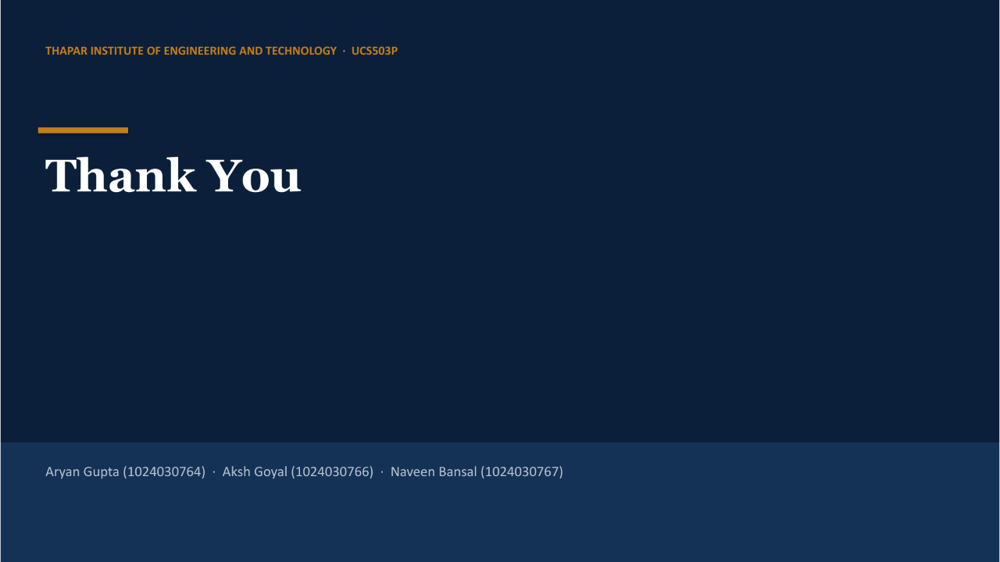
